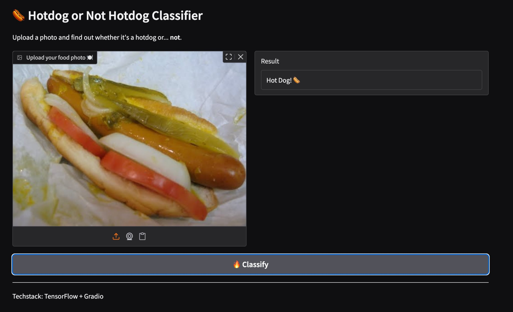
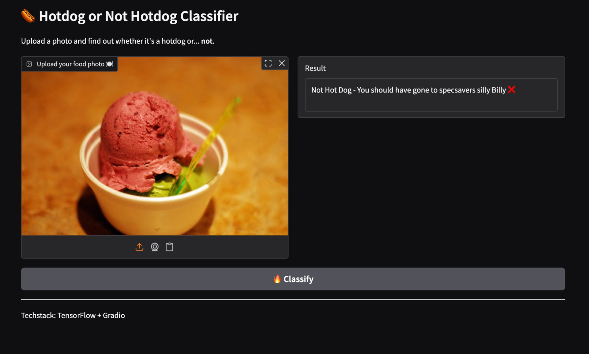

# 🌭 Hotdog or Not Hotdog Classifier

A fun and simple machine learning app that tells you whether your food photo is a hot dog... or **not**.

Built using:
- 🧠 TensorFlow (MobileNetV2)
- 🎨 Gradio for the web UI
- 📸 Pretrained image classifier from the “Hotdog vs Not Hotdog” dataset

---

## 🚀 Demo

Upload a food photo — and let the AI decide!

 <!-- Optional animated gif -->

---

## 🛠 How to Run It
``bash
1. Clone the repo:
git clone https://github.com/yourusername/hotdog-classifier.git
cd hotdog-classifier

2. Install dependencies:
pip install -r requirements.txt

3. Make sure your trained model (hotdog_model.h5) is in the same folder.

4. Run the app:
python hotdog_classifier.py

Upload fun food pics 

----

Project Structure
.
├── hotdog_classifier.py     # Gradio app
├── train_hotdog_model.py    # (Optional) Training script
├── hotdog_model.h5          # Trained Keras model
├── requirements.txt
└── README.md
